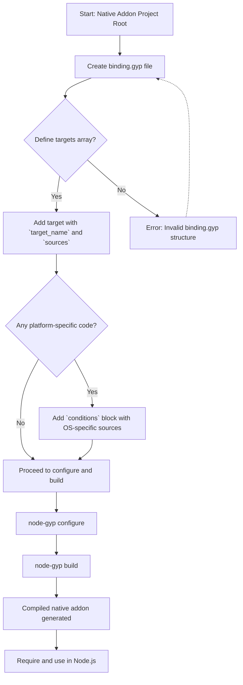

# Frequently Asked Questions: How do I create and structure a binding.gyp file?

Welcome to the core guide for understanding the `binding.gyp` file — your essential configuration blueprint used by `node-gyp` to build native Node.js addons. This FAQ will guide you through what a `binding.gyp` file is for, how to structure it correctly, and where to place it in your project for smooth, reliable builds.

---

## 1. What is the purpose of a binding.gyp file?

The `binding.gyp` file is a JSON-like configuration file that describes how to build the native addon's source code. It tells `node-gyp` what source files to compile, what targets to build, and which dependencies or flags to apply. Placing this file at the root of your module allows `node-gyp` to generate the necessary platform-specific build files (e.g., Makefiles on Unix, Visual Studio projects on Windows) seamlessly.

> Think of it as the roadmap guiding the compilation of your native extension, making cross-platform builds consistent and manageable.

---

## 2. Where should I place the binding.gyp file?

Place your `binding.gyp` file right at the root directory of your Node.js addon project — alongside your `package.json` file. This makes it easy for `node-gyp` to detect and process it without additional configuration.

---

## 3. What is the basic structure of a binding.gyp file?

At its core, the `binding.gyp` file is a single JSON-like dictionary containing a `targets` list. Each target specifies a build target, like a native library or executable.

Here’s a minimal example to get you started:

```json
{
  "targets": [
    {
      "target_name": "binding",
      "sources": ["src/binding.cc"]
    }
  ]
}
```

### Explanation:
- `targets`: Array containing one or more build targets.
- `target_name`: Unique identifier for your compiled addon target.
- `sources`: List of source files (relative paths) that `node-gyp` will compile.

This minimal `binding.gyp` builds an addon named `binding.node` from the source file at `src/binding.cc`.

---

## 4. What are the common attributes in binding.gyp targets?

Here are essential attributes you'll commonly use:

| Attribute             | Description                                                                                     |
|-----------------------|-------------------------------------------------------------------------------------------------|
| `target_name`         | Unique name for the build target, used as output filename and project target.                   |
| `type`                | Specifies the type of target (`executable`, `static_library`, `shared_library`, or `<(library)`). Defaults to `<(library)` for libraries. |
| `sources`             | List of source file paths to compile (relative to binding.gyp location).                        |
| `include_dirs`        | Directories to add to the compiler's include path (like `-I` flags).                           |
| `defines`             | Preprocessor defines, e.g., `DEBUG=1`.                                                         |
| `dependencies`        | Other target names or external `.gyp` files this target depends on.                             |
| `direct_dependent_settings` | Settings (`defines`, `include_dirs`, etc.) that propagate to targets that depend on this target, ensuring consistent builds. |
| `conditions`          | OS- or environment-specific conditional blocks to add platform-specific sources or flags.      |

---

## 5. How do I structure sources for platform-specific files?

`binding.gyp` supports conditional inclusion to handle platform differences elegantly:

### Common pattern - filename suffixes
Naming source files with platform-specific suffixes allows automatic exclusion of irrelevant files on other platforms. For example:

- `foo_win.cc` for Windows
- `foo_linux.cc` for Linux
- `foo_mac.cc` for macOS

Add all such files to the `sources` list. `node-gyp`’s platform conditions automatically exclude them on non-matching platforms.

### Using `conditions` for explicit platform management
If you cannot rename files, use `conditions` to control inclusion:

```python
{
  "targets": [
    {
      "target_name": "binding",
      "sources": ["common.cc"],
      "conditions": [
        ["OS=='win'", {
          "sources": ["windows_specific.cc"]
        }],
        ["OS=='linux'", {
          "sources": ["linux_specific.cc"]
        }]
      ]
    }
  ]
}
```

This ensures platform-specific sources only compile on the intended OS.

---

## 6. Can I see real-world examples of binding.gyp files?

Absolutely! Reviewing working examples is invaluable for learning idiomatic usage.

The documentation includes a curated list of real `binding.gyp` files from popular open-source Node.js modules:

- [node-sqlite3 binding.gyp](https://github.com/developmentseed/node-sqlite3/blob/master/binding.gyp)
- [node-canvas binding.gyp](https://github.com/LearnBoost/node-canvas/blob/master/binding.gyp)
- [node-ffi binding.gyp](https://github.com/rbranson/node-ffi/blob/master/binding.gyp)
- [node-serialport binding.gyp](https://github.com/voodootikigod/node-serialport/blob/master/binding.gyp)

You can browse over 50 such examples here in the [binding.gyp files in the wild](https://github.com/nodejs/node-gyp/blob/main/docs/binding.gyp-files-in-the-wild.md) page.

---

## 7. Are there tools or references to help understand binding.gyp files better?

For deeper understanding, consider:

- The [GYP User Documentation](https://gyp.gsrc.io/docs/UserDocumentation.md) covers detailed syntax, target types, conditions, and examples.
- The [gyp Input Format Reference](https://gyp.gsrc.io/docs/InputFormatReference.md) contains the formal language specification.
- Example addon projects like [nodejs/node test/addons/hello-world](https://github.com/nodejs/node/tree/main/test/addons/hello-world) illustrate practical usage.

---

## 8. What common mistakes should I avoid when creating binding.gyp?

- **Incorrect file placement:** Always ensure `binding.gyp` is at your project root.
- **Missing sources:** Listing source files with incorrect relative paths causes build failures.
- **Ignoring platform differences:** Use `conditions` or platform-specific file naming to ensure builds succeed across OSes.
- **Not using `direct_dependent_settings` for libraries:** If your target is a library, properly specify `direct_dependent_settings` to propagate flags to dependents.
- **Syntax errors:** `binding.gyp` is JSON-like but allows trailing commas and comments with `#`. Use a JSON linter where possible.

---

## 9. How can I quickly create a basic binding.gyp file?

<Steps>
  <Step title="Step 1: Identify your source files">
  Decide which `.cc` (or `.cpp`) files need compilation.
  </Step>
  <Step title="Step 2: Create binding.gyp at your project root">
  Use a text editor to create the file next to your `package.json`.
  </Step>
  <Step title="Step 3: Define the minimal target">
  Add a JSON structure like this:

  ```json
  {
    "targets": [
      {
        "target_name": "binding",
        "sources": ["src/your_source.cc"]
      }
    ]
  }
  ```
  </Step>
  <Step title="Step 4: Add platform-specific conditions if needed">
  Use the `conditions` property to tailor source files or defines per OS.
  </Step>
  <Step title="Step 5: Run node-gyp configure and build">
  From the directory, run:

  ```bash
  node-gyp configure
  node-gyp build
  ```

  Make sure no errors occur.
  </Step>
</Steps>

---

## 10. Where can I find more information or get help?

- Visit the [Node-GYP GitHub repository](https://github.com/nodejs/node-gyp) for issues and wiki pages.
- Join community forums or Stack Overflow tagged [`node-gyp`](https://stackoverflow.com/questions/tagged/node-gyp).
- Explore related docs sections: [Creating Your binding.gyp](https://docs.nodejs.org/getting-started/first-build-validation/creating-binding-gyp) and [Addon configs and examples](https://docs.nodejs.org/overview/integration-and-ecosystem/addon-configs-and-examples).

---

## Summary Diagram: Creating and Using binding.gyp



---

## Additional Tips & Best Practices

- **Keep your sources organized:** Use subdirectories (e.g., `src/`) and keep file references relative.
- **Sort your sources alphabetically:** Ensures consistency and easier diffs.
- **Comment your `binding.gyp`:** While `gyp` supports its limited comment syntax (`#`), use sparingly.
- **Incrementally enhance:** Start simple and add `defines`, `include_dirs`, and `dependencies` later as needed.
- **Validate often:** Run `node-gyp configure` frequently to catch syntax or configuration errors early.

---

For further examples, consult the [binding.gyp-files-in-the-wild.md](https://github.com/nodejs/node-gyp/blob/main/docs/binding.gyp-files-in-the-wild.md) page.

---

# Related Documentation

- [Creating Your binding.gyp File (Guide)](/getting-started/first-build-validation/creating-binding-gyp)
- [Addon Configs and Examples (Overview)](/overview/integration-and-ecosystem/addon-configs-and-examples)
- [GYP User Documentation](https://gyp.gsrc.io/docs/UserDocumentation.md)
- [Troubleshooting Common Errors](/getting-started/troubleshooting-common-issues/common-errors-and-solutions)

# External Resources

- [GYP Project Home](https://gyp.gsrc.io)
- [Node.js Native Addons Tutorial (Going Native)](http://nodeschool.io/#goingnative)

---

This FAQ equips you with a clear foundation to create and manage `binding.gyp` files, enabling you to build robust native addons with confidence.
