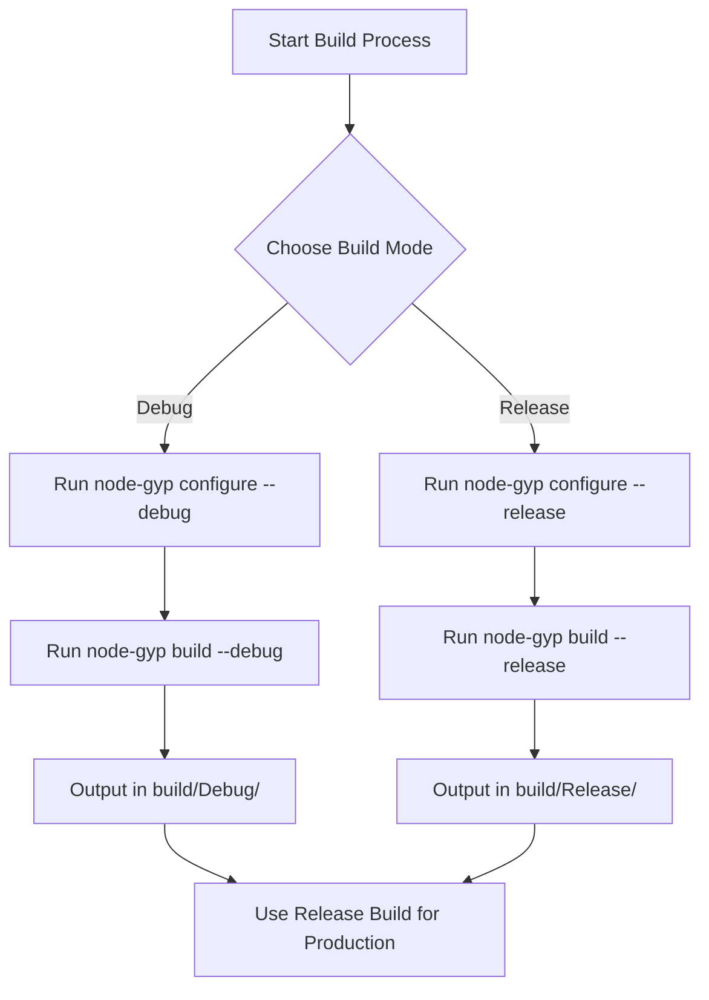

# How do I build in Debug vs. Release mode?

Understanding the difference between Debug and Release build modes is crucial for effective development with `node-gyp`. This page explains the key distinctions between these two modes, how to specify them when building your native addon, the location of the output files, and best practices on when to use each mode.

---

## What are Debug and Release build modes?

- **Debug mode** builds your native addon with additional debugging symbols and disables certain compiler optimizations. This makes the build slower and larger but provides detailed information useful when debugging, including helpful error messages and stack traces.

- **Release mode** builds your addon optimized for performance, enabling compiler optimizations and stripping debugging information. This results in faster, smaller binaries suitable for production use.

---

## How do I specify Debug or Release mode when building?

With `node-gyp`, you can easily switch between Debug and Release build modes via command-line flags or configuration options:

- To **build in Debug mode**, add the `--debug` or `-d` flag to any of the build-related commands such as `configure`, `build`, or `rebuild`:

  ```bash
  node-gyp configure --debug
  node-gyp build --debug
  # or combined
  node-gyp rebuild --debug
  ```

- To **build in Release mode**, use the `--release` flag or omit the `--debug` flag completely:

  ```bash
  node-gyp configure --release
  node-gyp build --release
  ```

  Release mode is the default if no mode is specified.

---

## Where are the build outputs located?

After building, your compiled native addon binary (`.node` file) will be placed inside the `build/` directory of your project in one of the two subdirectories:

- `build/Debug/` — Output folder used when building in Debug mode.
- `build/Release/` — Output folder used when building in Release mode.

You can require the native addon in Node.js by pointing to these `.node` files:

```js
const binding = require('./build/Debug/binding.node');  // Debug build
const binding = require('./build/Release/binding.node'); // Release build
```

> Typically, your development environment uses the Debug build for easier troubleshooting, while the Release build is used for production deployments.

---

## How does the build mode affect the build process?

- In **Debug mode**:
  - The build system adds compiler flags that enable generation of debug symbols.
  - Compiler optimizations are disabled or reduced.
  - The output binary includes symbol information to enable debuggers to map native code back to your source.

- In **Release mode**:
  - Debugging information is stripped or minimized.
  - Compiler optimizations enhance performance.
  - Output binaries are smaller and faster.

`node-gyp` internally manages these flags through configuration files like `config.gypi`, which is generated during `configure` and consumed during `build`. You primarily control the mode through the command line without needing to delve into internal implementation.

---

## Best practices: when to use Debug vs. Release mode

- Use **Debug mode** when
  - You are actively developing your addon and need to trace issues or step through native code.
  - You want more verbose logging or detailed error messages.
  - You need to run under a debugger such as `lldb` or Visual Studio Debugger.

- Use **Release mode** when
  - Preparing your addon for publishing or production usage.
  - You need maximum runtime performance and minimal binary size.
  - You want to ensure builds reflect production-like optimizations.

It is a good workflow to rapidly iterate in Debug mode, then switch to a Release build for final testing and deployment.

---

## Related configuration options

- You can toggle Debug mode via the `debug` option programmatically or in environment flags:
  - e.g. `--debug` / `--no-debug`, or shorthand `debug`/`release`

- Other related flags that influence build behavior:
  - `--arch` to set target architecture
  - `--jobs` to parallelize builds

Check other CLI options in the broader documentation for customization.

---

## Troubleshooting Debug vs. Release build issues

<AccordionGroup title="Common Questions and Solutions">
<Accordion title="I see my build output in build/Release but expected Debug" >
Ensure you passed `--debug` to **both** the `configure` and `build` commands, or use `rebuild --debug` to combine them.

If you only run `configure` or `build` with `--debug`, it may default to Release.
</Accordion>
<Accordion title="How can I verify which mode was used to build?">
Look inside the generated `build/config.gypi` file. It includes a `default_configuration` field indicating `Debug` or `Release`.

Verbose logs (`--verbose`) also show the active build type.
</Accordion>
<Accordion title="My Debug binary crashes or is missing symbols" >
Double-check your native addon code and debugger setup. Debug symbols depend on correct compiler flags and build environment.

Clean the build (`node-gyp clean`) and rebuild in Debug mode to reset.
</Accordion>
</AccordionGroup>

---

## Summary

Building in Debug vs. Release mode controls optimizations and debug info:

| Mode    | Purpose                              | Output Folder           | When to Use                      |
|---------|------------------------------------|------------------------|---------------------------------|
| Debug   | Development and debugging           | `build/Debug/`         | While developing and troubleshooting |
| Release | Optimized production-ready binaries | `build/Release/`       | Preparing for production or deployment |

Use `node-gyp configure/build --debug` for Debug builds and omit or use `--release` for Release builds. Your `.node` addon binary will end up in the corresponding folder.

---

## Additional Resources

- [Getting Started: Configuring and Building Your Addon](https://docs.node-gyp.org/getting-started/first-build-validation/running-configure-build-commands)
- [Binding.gyp File Basics](https://docs.node-gyp.org/guides/getting-started/binding-gyp-basics)
- [Troubleshooting Common Issues](https://docs.node-gyp.org/getting-started/troubleshooting-common-issues/common-errors-and-solutions)
- [Node-gyp CLI Options & Configuration](https://docs.node-gyp.org/README.md#command-options)

For detailed examples of toggling Debug/Release builds in your workflow, check out these guides and start experimenting to fit your addon development process.

---

<Tip>
Remember to always perform a clean rebuild when switching between Debug and Release modes to avoid inconsistent binaries.
</Tip>

<Tip>
Use verbose logging (`--verbose`) to gain insights during builds and confirm which mode is active.
</Tip>

---

## Visual Overview



This diagram visualizes the flow from selecting the build mode to the resulting output and intended usage.

---

