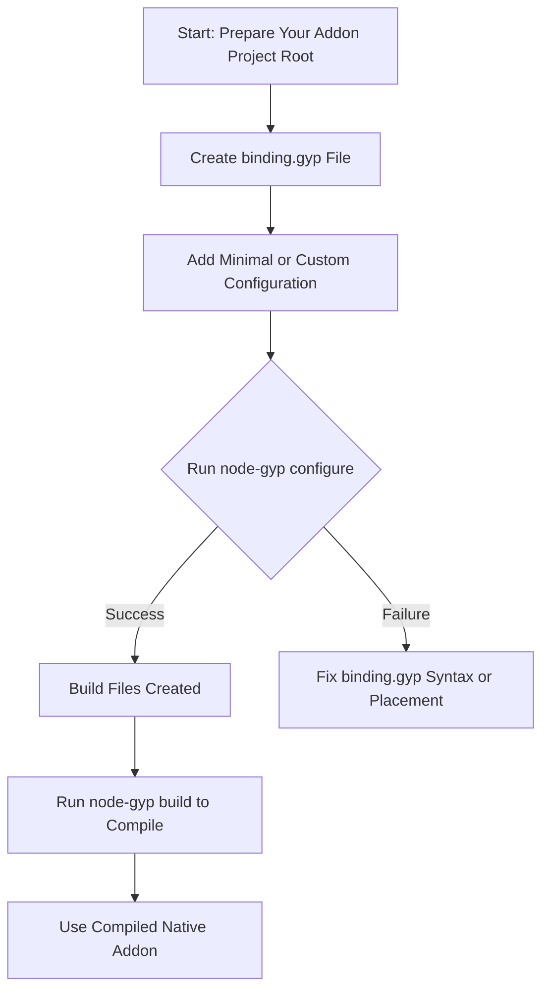

# Creating Your binding.gyp File

## Introduction

The `binding.gyp` file is the cornerstone configuration file that tells `node-gyp` how to build your native Node.js addon. It defines the targets to build, source files, and build settings in a platform-independent, JSON-like format. This guide will help you understand the purpose and structure of the `binding.gyp` file, how to create a minimal but functional configuration, and best practices for placing it correctly in your project for a successful build.

## Purpose of binding.gyp

`binding.gyp` describes the build configuration for your native addon module. During the `node-gyp configure` step, this file is processed to generate platform-specific build systems (such as Makefiles on Unix/macOS, or Visual Studio projects on Windows), orchestrating how your source files compile and link into a `.node` binary.

### What does binding.gyp control?

- **Targets**: Defines what output to build (e.g., your native addon binary).
- **Sources**: Lists the native source files to compile.
- **Build Settings**: Sets compiler flags, include directories, definitions, dependencies, and platform conditionals.

## Location in Your Project

For `node-gyp` to find your `binding.gyp`, place it in the **root directory of your addon project**, alongside your `package.json` file. This is typically the directory you run `node-gyp configure` or `node-gyp build` from.

```plaintext
/my-addon-project/
  ├── binding.gyp
  ├── package.json
  └── src/
      └── addon.cc
```

If `binding.gyp` is missing or misplaced, `node-gyp` will report an error:

```bash
Error: Could not locate the binding.gyp file
```

## Minimal binding.gyp Structure

The file must contain a single Python-style dictionary with the following **required top-level keys**:

- `targets`: An array of target definitions.

Each `target` is itself a dictionary specifying:

- `target_name`: The name of the target (build output)
- `sources`: An array of source files to compile

### Minimal Example

```python
{
  'targets': [
    {
      'target_name': 'addon',
      'sources': [ 'src/addon.cc' ]
    }
  ]
}
```

This configuration instructs `node-gyp` to build a native addon named `addon` by compiling the source file `src/addon.cc`.

## Creating Your Minimal binding.gyp

<Steps>
<Step title="Create the binding.gyp file in your project root">
Create a new text file named `binding.gyp` in the root folder of your addon project, exactly alongside `package.json`.
</Step>
<Step title="Add the minimal JSON-like content">
Copy and paste the following into the file, then save it:

```python
{
  'targets': [
    {
      'target_name': 'addon',
      'sources': [ 'src/addon.cc' ]
    }
  ]
}
```

Modify `'src/addon.cc'` to the relative path of your addon’s main C++ source file.
</Step>
<Step title="Verify indentation and syntax">
Ensure the file:
- Uses single quotes for string literals.
- Has commas after list/dictionary entries (including trailing commas allowed).
- Is syntactically correct JSON-like Python dictionary (comments allowed, but not recommended).
</Step>
</Steps>

<Note>
The `binding.gyp` file is **not** a strict JSON file; it uses Python dictionary syntax with slight deviations:

- Single quotes are preferred.
- Trailing commas in lists and dictionaries are allowed.
- Comments starting with `#` are permitted.

This syntax allows comments and line breaks for readability.
</Note>

## Common Optional Sections

While the minimal `binding.gyp` works to build a simple addon, many real projects require additional sections:

- **`type`**: Can specify the target type such as `shared_library` (default for Node addons) or `static_library`. For most addons, omit or set to `shared_library`.
- **`include_dirs`**: Specify additional header search paths.
- **`defines`**: Add C/C++ preprocessor definitions.
- **`dependencies`**: Specify other build targets your addon depends on.
- **`conditions`**: Specify platform-specific source files or settings.

Example with a few optional settings:

```python
{
  'targets': [
    {
      'target_name': 'addon',
      'type': 'shared_library',
      'sources': [ 'src/addon.cc', 'src/helper.cc' ],
      'include_dirs': [ '<!(node -e "require(\'node-addon-api\')")' ],
      'defines': [ 'NAPI_DISABLE_CPP_EXCEPTIONS' ],
      'conditions': [
        ['OS=="win"', {
          'defines': [ 'WIN32_LEAN_AND_MEAN' ]
        }]
      ]
    }
  ]
}
```

## Best Practices and Tips

- **Keep It Simple at First**: Use the minimal example to verify your environment and build setup.
- **Relative Paths**: Always specify source and include paths relative to the directory containing `binding.gyp`.
- **Use `conditions` for Platform-Specific Code**: Leverage `conditions` with expressions like `'OS=="win"'` to add or exclude files per platform.
- **Maintain Formatting**: Although `binding.gyp` files tolerate trailing commas and comments, keep the structure clean for readability.

## Troubleshooting Common Issues

<Tip>
If running `node-gyp configure` reports it cannot find `binding.gyp`:
- Confirm the file is named exactly `binding.gyp` (case-sensitive on Unix).
- Ensure you run commands from the directory containing `binding.gyp`.
- Check for syntax errors in the file.
</Tip>

<Warning>
Invalid JSON syntax (like double quotes inside double quotes, or missing commas) will cause `node-gyp` to fail silently or with confusing errors. Validate your `binding.gyp` syntax carefully.
</Warning>

## Summary Flow



## Additional Resources

- [node-gyp Overview & Architecture](https://nodejs.org/api/node-gyp.html#overview)
- [binding.gyp File Examples](../overview/integration-and-ecosystem/addon-configs-and-examples)
- [Writing Your First binding.gyp File Guide](../guides/getting-started/binding-gyp-basics)
- [Common Errors and How to Fix Them](../getting-started/troubleshooting-common-issues/common-errors-and-solutions)

## Next Steps

Once your `binding.gyp` file is correctly created and placed:

1. Run `node-gyp configure` to generate platform-specific build files.
2. Run `node-gyp build` to compile your native addon.
3. Load the compiled `.node` file in your Node.js code and test it.

For more detailed examples and advanced configurations, refer to the `Example: binding.gyp and Typical Addon Structure` page in the Integration & Ecosystem section.

---