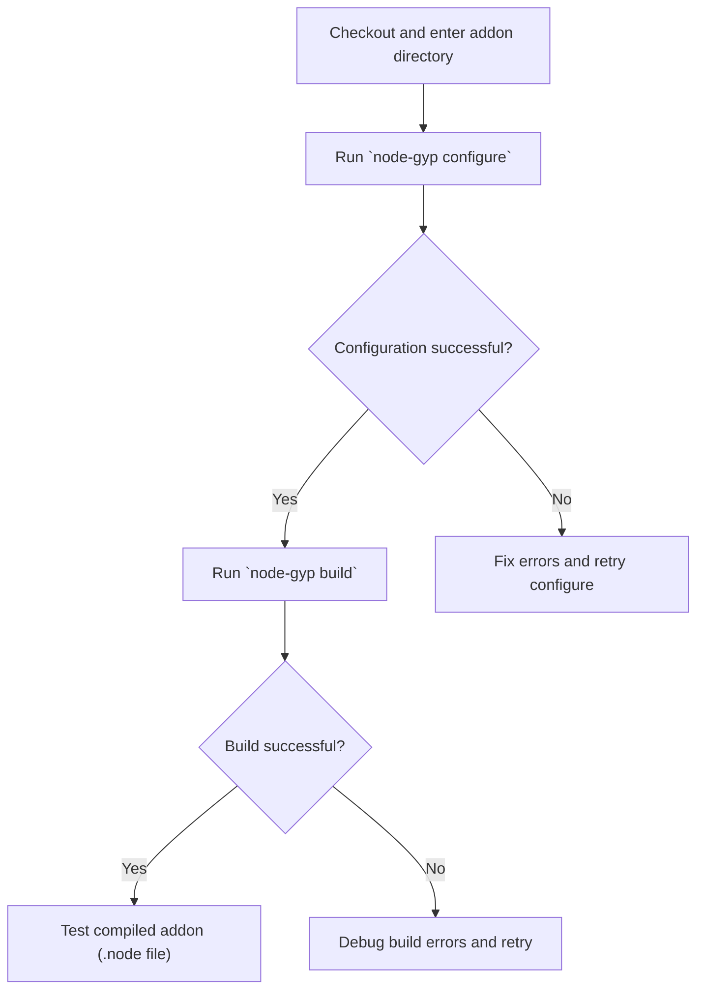

# Configuring and Building Your Addon

Follow this step-by-step workflow to configure and build your first native Node.js addon using `node-gyp`. This guide covers running the essential `configure` and `build` commands, explains the expected outputs, and introduces common flags and options to help you build your addon rapidly and confidently.

---

## 1. Prepare Your Project Directory

Before running any commands, ensure you are inside the root directory of your addon, where your `binding.gyp` file resides.

```bash
cd /path/to/your/addon
```

> **Tip:** The `binding.gyp` file is crucial as it describes how your native module should be built. If you don’t have one yet, see the [Creating Your binding.gyp File](https://docs.nodejs.org/getting-started/first-build-validation/creating-binding-gyp) guide.

---

## 2. Run the `configure` Command

The `configure` step generates platform-specific build files tailored for your current environment.

### What it Does:
- Detects your Node.js headers and sets up development files.
- Creates a `build/` directory containing `Makefile` on Unix/macOS or `.vcxproj` files on Windows.
- Prepares configuration files like `config.gypi` and `common.gypi` used during building.

### Basic Usage:

```bash
node-gyp configure
```

### Common Options:
- `--nodedir=path` — Use a custom Node.js source directory for headers/build files.
- `--target=version` — Target a specific Node.js version different from your current runtime.
- `--msvs_version=version` (Windows only) — Specify which Visual Studio version to use.
- `--debug` — Generate Debug configuration instead of Release.

### Example:

```bash
node-gyp configure --target=16.13.0 --debug
```

### What to Expect:
- A `build/` directory is created.
- `config.gypi` and `common.gypi` files appear inside `build/`.
- On success, you see logs confirming generation and paths of build files.

<Check>
Ensure you see no errors and that `build/` exists with generated project files.
</Check>

---

## 3. Run the `build` Command

This step compiles your addon using the generated project files.

### What it Does:
- Calls the underlying build tool (`make`, `msbuild`, or `gmake` depending on platform).
- Produces the compiled `.node` binary in `build/Release/` or `build/Debug/` based on configuration.

### Basic Usage:

```bash
node-gyp build
```

### Common Options:
- `--jobs n` — Run parallel build jobs (e.g., `--jobs=max` uses all CPU cores).
- `--debug` — Build using Debug configuration.

### Example:

```bash
node-gyp build --jobs max
```

### What to Expect:
- Build output showing compilation progress.
- On Windows, `msbuild` output; on Unix/macOS, `make` output.
- The final `.node` file in `build/Release/youraddon.node` or `build/Debug/youraddon.node`.

<Check>
Confirm the `.node` file exists and the build log ends without errors.
</Check>

---

## 4. Using Flags and Options to Customize Your Build

You can pass various flags to tailor the configure and build steps.

### Important Flags:

| Flag                      | Purpose                                                                                     |
|---------------------------|---------------------------------------------------------------------------------------------|
| `--target=version`         | Target a specific Node.js version for build.                                                |
| `--nodedir=path`           | Use a custom directory for Node.js headers and source files.                               |
| `--msvs_version=version`   | Specify Visual Studio version when on Windows.                                             |
| `--jobs n` or `-j n`      | Run builds in parallel using `n` jobs (`max` to use all CPU cores).                        |
| `--debug` or `-d`          | Build with Debug configuration.                                                             |
| `--release` or `--no-debug`| Build with Release configuration (default).                                                |
| `--thin=yes`               | Enable thin static libraries (affects build output size and linking).                       |

### Passing Additional Arguments
You can pass flags to both `configure` and `build` by placing them after the command. For example:

```bash
node-gyp configure --debug --msvs_version=2019
node-gyp build --jobs=4
```

---

## 5. Typical Workflow Commands Sequence

To build an addon from scratch, the sequence is:

<Steps>
<Step title="Step 1: Configure">
Run `node-gyp configure` to generate build scripts for your environment.
</Step>
<Step title="Step 2: Build">
Run `node-gyp build` to compile your native addon.
</Step>
</Steps>

Optionally, you can combine them using the `rebuild` command:

```bash
node-gyp rebuild
```

This runs `clean`, `configure`, and `build` in sequence, useful when making major changes.

---

## 6. Understanding the Build Outputs

- **`build/config.gypi`** — A JSON file auto-generated during `configure` holding build configuration.
- **`build/common.gypi`** — Contains common build definitions from Node.js headers.
- **`build/Makefile` or `build/*.vcxproj`** — The platform-specific project files.
- **`build/Release/youraddon.node`** — The compiled addon binary (or `Debug` folder if built with debug).

> **Note:** These are automatically managed by `node-gyp` and should not be edited manually.

---

## 7. Troubleshooting Common Issues

<AccordionGroup title="Troubleshooting Common Errors During Configure and Build">
<Accordion title="Build Directory Not Created or Missing Files">
Ensure you have the correct permissions in your project directory. Run the `configure` command again and watch for any errors creating the `build/` directory.
</Accordion>
<Accordion title="Error: You must run `node-gyp configure` first!">
Run `node-gyp configure` before the `build` command. The build relies on generated config files.
</Accordion>
<Accordion title="Visual Studio Version Detection Fails on Windows">
Specify your Visual Studio version explicitly with `--msvs_version=2019` (or your installed version). Also, check that Visual Studio and the required C++ workloads are installed.
</Accordion>
<Accordion title="Missing Node.js Headers or Incorrect Node Version">
Use `--nodedir=path` or `--target=version` to specify the correct Node.js headers if auto-detection fails.
</Accordion>
<Accordion title="Build Fails with Compiler or Linker Errors">
Verify your compiler toolchain is properly installed and compatible with your Node.js installation. Review your `binding.gyp` for errors.
</Accordion>
</AccordionGroup>

---

## 8. Next Steps

- After a successful build, require your addon in Node.js for testing:

```js
const addon = require('./build/Release/youraddon.node');
console.log(addon.yourFunction());
```

- Explore:
  - [Creating Your binding.gyp File](https://docs.nodejs.org/getting-started/first-build-validation/creating-binding-gyp) to write or customize your project configuration.
  - [Validating Your Setup](https://docs.nodejs.org/getting-started/first-build-validation/validating-installation) to ensure your environment is ready.
  - [Common Errors and Solutions](https://docs.nodejs.org/getting-started/troubleshooting-common-issues/common-errors-and-solutions) for help with frequent issues.

---

# Diagram: Workflow Overview



---

For more detailed examples and platform-specific considerations, refer to the guides in the Getting Started section.

---

## References

- [node-gyp README](https://github.com/nodejs/node-gyp/blob/main/README.md)
- [binding.gyp creation guide](https://docs.nodejs.org/getting-started/first-build-validation/creating-binding-gyp)
- [Supported Workflows](https://docs.nodejs.org/overview/core-concepts-and-architecture/supported-workflows)
- [Configuring and Building Your Addon (this page)](https://docs.nodejs.org/getting-started/first-build-validation/running-configure-build-commands)

## Getting Help

- Check the [Common Errors and How to Fix Them](https://docs.nodejs.org/getting-started/troubleshooting-common-issues/common-errors-and-solutions) guide for troubleshooting help.
- Open issues or discussions on the [node-gyp GitHub repository](https://github.com/nodejs/node-gyp).


