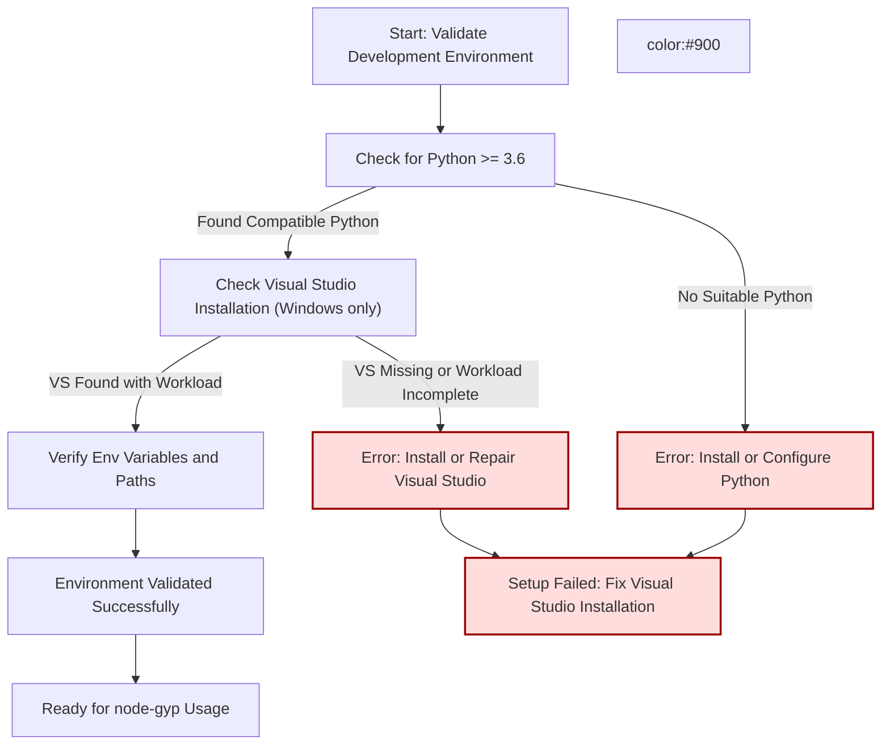

# Validating and Repairing Your Development Environment

Ensure your native build environment is fully prepared for node-gyp by methodically validating your Python installation, compiler toolchain, and related dependencies. This guide outlines practical step-by-step checks, key environment variable tips, and repair commands to rapidly diagnose and fix common environment issues.

---

## 1. Verify Your Python Setup

Python is essential for node-gyp. This step confirms that a compatible Python executable (version 3.6 or newer) is available and correctly configured.

### Step 1: Automatic Python Detection

Run the following script included with node-gyp to locate a suitable Python executable:

```bash
node -e "require('node-gyp/lib/find-python').findPython().then(console.log).catch(console.error)"
```

This tries several methods:
- Uses environment variables like `NODE_GYP_FORCE_PYTHON` and `PYTHON`
- Checks command line or npm config Python paths
- On Windows, attempts to use the `py` launcher
- Checks common default install locations

Success outputs the absolute path to your Python executable.

### Step 2: Confirm Python Version Compatibility

The detected Python must be version 3.6 or later. To manually confirm, run:

```bash
<python_path> --version
```

Example:

```bash
C:\Python39\python.exe --version
# Output: Python 3.9.5
```

### Troubleshooting Python Issues

If no suitable Python is found:

- Install the latest Python 3.x from https://python.org/downloads/
- Ensure it is added to your PATH environment variable.
- Manually specify the Python executable when invoking node-gyp:

```bash
node-gyp configure --python="C:\Path\To\python.exe"
```

Or set environment variables permanently (Windows example):

```powershell
setx PYTHON "C:\Path\To\python.exe"
```

<Tip>
Use the `NODE_GYP_FORCE_PYTHON` environment variable to override Python discovery with a specific path.
</Tip>

---

## 2. Validate Compiler Toolchain (Windows)

For Windows users, node-gyp requires Visual Studio C++ Build Tools (2015 or later) with the `Desktop development with C++` workload installed.

### Step 1: Detect Visual Studio Installation

Run the Visual Studio finder script:

```bash
node -e "require('node-gyp/lib/find-visualstudio').findVisualStudio().then(console.log).catch(console.error)"
```

It searches for Visual Studio installations by:
- Registry queries
- PowerShell scripts querying `VSSetup` module
- Environment variables like `VCINSTALLDIR`

Output shows the selected VS version, MSBuild path, toolset, and SDK.

### Step 2: Confirm Required Workload and SDKs

Make sure your installation includes:
- Microsoft.VisualStudio.Component.VC.Tools.x86.x64
- Windows 10 or 11 SDK (e.g. Windows10SDK 10.x.x.x or Windows11SDK 10.x.x.x)

Verify MSBuild executable exists at the displayed path.

### Step 3: Troubleshooting Visual Studio Detection

If Visual Studio is not found or lacks required components:

1. Open Visual Studio Installer.
2. Modify your installation.
3. Select "Desktop development with C++" workload.
4. Ensure Windows SDK is installed.
5. Re-run the detection script.

If running inside a Visual Studio Command Prompt, node-gyp automatically uses that environment.

<Warning>
Visual Studio 2017 and later are only supported on Node.js versions up to 21. For newer Node.js, use VS2019 or VS2022.
</Warning>

---

## 3. Checking node-gyp Dependencies and Environment Variables

To ensure smooth operation, verify these environment variables and dependencies:

- `PYTHON`: Should point to your Python 3 executable if not detected automatically.
- `GYP_MSVS_VERSION`: Optional override for the Visual Studio version (e.g., `2019`).
- `VCINSTALLDIR`: Set automatically in Visual Studio Command Prompt; specifies Visual Studio root.
- `NODE_GYP_FORCE_PYTHON`: Forces a specific Python executable.

Validate environment variables by running:

```bash
# Windows
set PYTHON
set GYP_MSVS_VERSION
set VCINSTALLDIR

# Unix/macOS
echo $PYTHON
```

Ensure that your compiler and Python are discoverable in PATH.

---

## 4. Repairing Common Environment Issues

### Repair Python Setup

- Reinstall Python 3.x from the official source.
- Manually specify Python path with:

```bash
node-gyp configure --python="/full/path/to/python"
```

- Clear conflicting environment variables like `PYTHON` or `NODE_GYP_FORCE_PYTHON` if set incorrectly.

### Repair Visual Studio Setup on Windows

- Re-run the Visual Studio Installer.
- Ensure workloads "Desktop development with C++" and Windows SDK are installed.
- If still failing, repair or reinstall Visual Studio.

### Environment Variable Cleanup

Remove any conflicting or obsolete environment variables:

```powershell
setx PYTHON ""
setx NODE_GYP_FORCE_PYTHON ""
setx GYP_MSVS_VERSION ""
```

Restart your terminal session after making changes.

<Note>
Restart the terminal or IDE after modifying environment variables to ensure changes take effect.
</Note>

---

## 5. Running Validation Scripts

Use the following quick test commands to ensure the environment is operational:

```bash
# Check Python
python --version

# Check MSBuild (Windows only)
"%ProgramFiles(x86)%\Microsoft Visual Studio\Installer\vswhere.exe" -latest -property installationPath
"%ProgramFiles(x86)%\Microsoft Visual Studio\2019\BuildTools\MSBuild\Current\Bin\MSBuild.exe" /version

# Run node-gyp configure
node-gyp configure --verbose
```

Successful output confirms correct environment setup.

---

## 6. Summary and Next Steps

Once your Python and compiler toolchain are validated and repaired:

- Proceed to create and configure your `binding.gyp` file.
- Run your first build using `node-gyp configure build`.
- Validate your native addon by loading it in Node.js.

For detailed build workflow, see [Configuring and Building Your Addon](/getting-started/first-build-validation/running-configure-build-commands).

If issues persist, consult [Common Errors and How to Fix Them](/getting-started/troubleshooting-common-issues/common-errors-and-solutions) for targeted fixes.

---

## Additional Resources

- [Installing node-gyp (All Platforms)](/getting-started/setup-prerequisites-installation/installation-all-platforms)
- [Configuring the Python Dependency](/getting-started/setup-prerequisites-installation/python-setup)
- [Windows: Visual Studio Setup](/getting-started/setup-prerequisites-installation/windows-visual-studio-setup)
- [What tools do I need to use node-gyp? (FAQ)](/faq/common-questions/required-tools)

---

<Tip>
Keeping your development environment up-to-date with the latest supported Python and Visual Studio versions ensures smoother addon builds and fewer compatibility issues.
</Tip>


---

### Mermaid Diagram: Environment Validation Flow



---