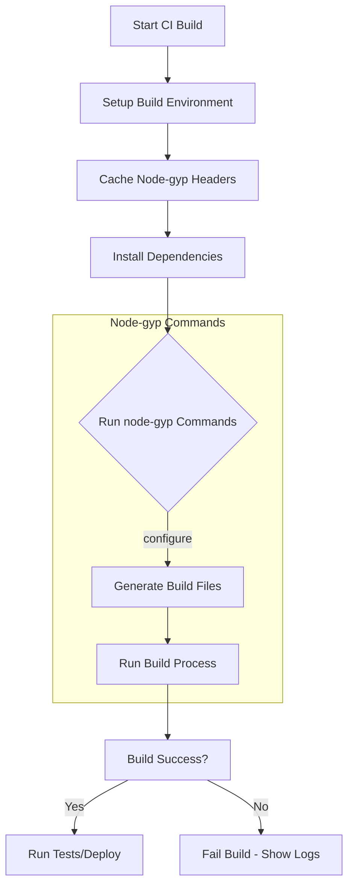

# Integrating node-gyp with CI/CD Pipelines

Automating the build of native Node.js addons in CI/CD pipelines using `node-gyp` ensures your modules compile reliably and consistently on every commit, pull request, or release. This guide provides practical steps, environment setup strategies, and best practices for seamless integration of `node-gyp` in popular continuous integration workflows.

---

## 1. Why Automate node-gyp Builds in CI/CD?

Native addons require compilation which depends on platform-specific tools, dependencies, and configuration. Manual builds are error-prone and inefficient for teams. Automating these builds in CI/CD:

- Catches compilation errors early
- Guarantees consistency across platforms
- Supports multi-version testing (different Node.js versions)
- Promotes continuous delivery of addons

By reliably automating `node-gyp` builds, you reduce integration friction and improve deployment quality.

---

## 2. Prerequisites for CI/CD Automation

Before automating your builds, ensure the following:

- **Node-gyp Installed in the Environment:** Usually as a global npm dependency or bundled in your project’s `devDependencies`.
- **Compatible Build Tools Installed:** 
  - On **Windows**: Visual C++ Build Tools or Visual Studio with necessary workloads.
  - On **macOS**: Xcode Command Line Tools.
  - On **Linux**: Make, Python, and GCC toolchain.
- **Python Setup:** `node-gyp` requires a specific Python version (typically 3.x, see Python setup guides).
- **Network Access for Header Downloads:** 
  - `node-gyp` fetches Node.js header files automatically.
  - Proxy or firewall configurations should allow these downloads.
- **Caching Strategy Prepared:** To speed up header and dependency downloads.

> See the [Prerequisites & System Requirements](https://nodejs.org/guides/getting-started/setup-prerequisites-installation/prerequisites-system-requirements) and [Installing and Setting Up node-gyp](https://nodejs.org/guides/guides/getting-started/installing-and-setting-up) guides for platform-specific setup.

---

## 3. Step-by-Step: Automating node-gyp in CI/CD Workflows

### Step 1: Prepare Your Build Environment

Configure your CI environment with all necessary build tools and Python. This commonly involves:

- Installing prerequisites via package managers (e.g., `apt`, `brew`, `choco`).
- Setting environment variables for consistent tooling versions (`PYTHON`, `MSVS_VERSION`, etc.).

#### Example: Ubuntu Setup Snippet
```bash
sudo apt-get update
sudo apt-get install -y python3 make g++
# Set Python path for node-gyp
export PYTHON=$(which python3)
```

### Step 2: Install node-gyp and Dependencies

Make sure `node-gyp` is accessible globally or installed locally:

```bash
npm install -g node-gyp
# or include in package.json devDependencies and run
npm install
```

### Step 3: Configure Caching for Headers and Dependencies

`node-gyp` downloads headers based on Node.js target versions into a development directory (`devdir`). Cache this directory between runs to avoid repeated downloads.

- Use the `--devdir` option or set the environment variable `npm_package_config_node_gyp_devdir` to a persistent cache path.

```yaml
# Example for GitHub Actions
- name: Cache node-gyp headers
  uses: actions/cache@v3
  with:
    path: ~/.cache/node-gyp
    key: ${{ runner.os }}-node-gyp-${{ hashFiles('package-lock.json') }}
```

### Step 4: Run `node-gyp` Commands Sequentially

Typical build commands integrated into your pipeline:

```bash
node-gyp configure   # Generates platform-specific build files
node-gyp build       # Compiles the addon
```

To clean and rebuild in one step, use:

```bash
node-gyp rebuild
```

### Step 5: Target Specific Node.js Versions

CI workflows commonly test multiple Node.js versions. Use `--target` to specify version and `--dist-url` if custom headers are needed (e.g., Electron).

```bash
node-gyp rebuild --target=16.14.0
```

or

```bash
node-gyp rebuild --target=22.0.0 --dist-url=https://electronjs.org/headers
```

### Step 6: Platform-Specific Considerations

- **Windows:** Ensure the Visual Studio version matches the one specified in the environment or `--msvs_version` flag.
- **macOS/Linux:** Toolchain is generally well-supported, but watch for missing `make` or compiler setups.

---

## 4. CI/CD Integration Best Practices

- **Wrap node-gyp commands in scripts:** Provide scripts in your `package.json` to abstract common build steps, making CI configuration simple.
- **Use Environment Variables for Flexibility:** 
  - Utilize `npm_package_config_node_gyp_*` to customize options without changing code.
  - Examples: custom Python path, MSVS version, parallel build jobs.
- **Parallelize builds carefully:** With the `-j` or `--jobs` option, you can speed up builds by utilizing multiple cores.

```bash
node-gyp build --jobs max
```

- **Log Verbosity:** Enable verbose or silly log levels for detailed diagnostics during CI failures.

```bash
node-gyp build --verbose
```

- **Fail Fast on Errors:** CI must halt on build failures to avoid deployment of broken artifacts.

- **Use the `rebuild` command:** This sequence cleans, configures, and builds in one atomic operation.

---

## 5. Common CI Integration Scenarios

### Scenario 1: Building with Caching on GitHub Actions

```yaml
jobs:
  build:
    runs-on: ubuntu-latest
    steps:
    - uses: actions/checkout@v3
    - uses: actions/setup-node@v3
      with:
        node-version: '16'
    - name: Cache node-gyp headers
      uses: actions/cache@v3
      with:
        path: ~/.cache/node-gyp
        key: ${{ runner.os }}-node-gyp-${{ hashFiles('package-lock.json') }}
    - run: npm install
    - run: node-gyp rebuild
```

### Scenario 2: Windows Build with MSVS Version Specified

```yaml
jobs:
  build:
    runs-on: windows-latest
    steps:
    - uses: actions/checkout@v3
    - uses: actions/setup-node@v3
      with:
        node-version: '18'
    - run: npm install
    - run: |
        node-gyp configure --msvs_version=2019
        node-gyp build
```

### Scenario 3: Electron Target with Custom Header Source

```bash
node-gyp rebuild --target=13.1.7 --dist-url=https://electronjs.org/headers
```

---

## 6. Troubleshooting Tips for CI Builds

- **Build fails due to missing headers:** Make sure your CI runner has network access, and caching locations are correct.
- **Python version compatibility errors:** Explicitly set `--python` flag or corresponding environment variables.
- **Visual Studio toolchain not found on Windows:** Specify `--msvs_version` or install correct workloads.
- **Build commands hang or fail silently:** Increase log verbosity with `--verbose` or `--silly` to diagnose.
- **Inconsistent build results across platforms:** Verify target architecture and platform flags like `--arch`.

For detailed troubleshooting, see the [Common Errors and How to Fix Them](https://nodejs.org/guides/getting-started/troubleshooting-common-issues/common-errors-and-solutions) and [Troubleshooting Common Build Errors](https://nodejs.org/guides/guides/real-world-scenarios/common-errors-troubleshooting) guides.

---

## 7. Summary Workflow Diagram



---

## 8. Additional Resources

- [node-gyp Official README](https://github.com/nodejs/node-gyp)
- [Prerequisites & System Requirements Guide](https://nodejs.org/guides/getting-started/setup-prerequisites-installation/prerequisites-system-requirements)
- [Python Dependency Configuration](https://nodejs.org/guides/getting-started/setup-prerequisites-installation/python-setup)
- [Windows Visual Studio Setup](https://nodejs.org/guides/getting-started/setup-prerequisites-installation/windows-visual-studio-setup)
- [Common Errors Troubleshooting](https://nodejs.org/guides/getting-started/troubleshooting-common-issues/common-errors-and-solutions)

---

> Automating native addon builds gives your team confidence and speed in deployment. Follow these guidelines carefully to ensure node-gyp integrates smoothly with your CI/CD workflow across all supported platforms.
