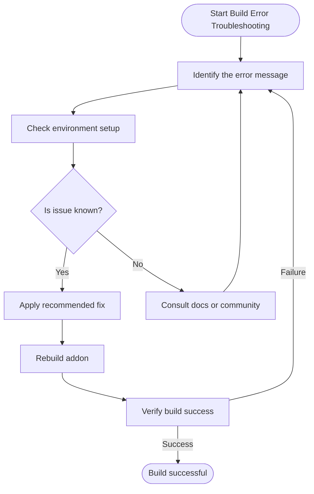

# Troubleshooting Common Build Errors

This guide provides clear, actionable solutions for the most frequent issues encountered when building native Node.js addons with `node-gyp`. From missing dependencies to compiler errors, version mismatches, and Python or Visual Studio detection problems, you will learn to identify and quickly resolve these roadblocks, keeping your development workflow productive.

---

## 1. Overview

When working with native addon builds, errors can block progress and cause confusion. This page focuses exclusively on helping you recognize common problems and fix them effectively without diving into internal node-gyp implementation details.

### What This Guide Covers

- Missing or incompatible dependencies
- Compiler and toolchain errors
- Node.js version and header mismatches
- Python interpreter detection issues
- Visual Studio build environment problems (Windows)

### Prerequisites

- A native addon project with a valid `binding.gyp` configured
- Basic environment setup for your target platform (Python, compilers, VS Build Tools)
- Familiar with running `node-gyp` commands (`configure`, `build`, `rebuild`)

### Expected Outcome

By following this guide, you will be able to:

- Pinpoint the cause of common `node-gyp` build failures
- Correct environment or configuration issues disrupting builds
- Resume building your native addons without repeated errors

### Estimated Time

10-30 minutes depending on the complexity of the encountered errors.

### Difficulty

Intermediate. While basic command-line familiarity is assumed, no deep knowledge of node-gyp internals is required.

---

## 2. Common Build Error Scenarios and Resolutions

<AccordionGroup title="Frequently Encountered Errors">
<Accordion title="Missing Development Headers or Invalid Node Version">

### Symptom

Build stops with errors indicating missing node headers or version mismatch, e.g., `gyp ERR! configure error`. 

### Cause

Occurs when `node-gyp` cannot find or download the correct native headers for your Node.js version, especially with `-pre` (development) or custom Node versions.

### How to Fix

1. **Check Node.js Version:** Avoid using `-pre` versions like `v0.11.2-pre`.
   - Instead, install and use a stable Node.js release.
2. **Specify `--nodedir` if Using `-pre` Versions:**
   - Supply the path to the Node source code when building, e.g.,

   ```bash
   node-gyp rebuild --nodedir=/path/to/node-source
   ```

   or with npm:

   ```bash
   npm install <module> --nodedir=/path/to/node-source
   ```

3. **Set npm Configuration for Repeated Builds:**

   ```bash
   npm config set nodedir /path/to/node-source
   ```

4. **Ensure Headers are Present:** Run

   ```bash
   node-gyp install
   ```

   to download needed headers.

---

### Example Error Message

```
Error: "pre" versions of node cannot be installed, use the --nodedir flag instead
```

### Reference

See the [Error for Pre Node Versions](https://github.com/nodejs/node-gyp/blob/main/docs/Error-pre-versions-of-node-cannot-be-installed.md) page for detailed examples.

</Accordion>

<Accordion title="Python Not Found or Version Mismatch">

### Symptom

Build ends with Python related errors or cannot find a suitable Python executable.

### Cause

`node-gyp` requires a supported Python version (typically Python 2.7 or Python >=3.6) to run its build scripts.

### How to Fix

1. **Install a Supported Python Version:**
   - Verify Python installation with `python --version` or `python3 --version`.
2. **Specify Python Explicitly:**

   ```bash
   node-gyp configure --python /path/to/python
   ```

3. **Configure Environment Variable:**
   - For npm users:

   ```bash
   export npm_config_python=/path/to/python
   ```

   - On Windows CMD:

   ```cmd
   set npm_config_python=C:\path\to\python.exe
   ```

4. **Check for Multiple Python Versions:** Using incompatible versions can cause errors.
5. **Use `NODE_GYP_FORCE_PYTHON` if Needed:** This environment variable forces node-gyp to use a specific Python interpreter.

---

### Tips

- Use `py --list-paths` (Windows) to view installed Python versions.
- Python 3.12+ requires the latest node-gyp version (>= v10).

</Accordion>

<Accordion title="Visual Studio or MSBuild Not Found (Windows Only)">

### Symptom

Build fails because Visual Studio or MSBuild cannot be found or is misconfigured.

### Cause

Missing or incorrect installation of Visual Studio C++ Build Tools, or node-gyp cannot detect them.

### How to Fix

1. **Install Necessary Build Tools:**
   - Use [Visual Studio Installer](https://visualstudio.microsoft.com/downloads/) to install "Desktop development with C++" workload.
   - Alternatively, install Build Tools standalone.
2. **Use Chocolatey for Setup:**

   ```powershell
   choco install python visualstudio2022-workload-vctools -y
   ```

3. **Verify Visual Studio Detection:**
   - Run
   
   ```bash
   node-gyp configure --msvs_version=2019
   ```

   if `node-gyp` needs help detecting installed VS version.
4. **Install VSSetup Powershell Module:** Helps detection under restrictive modes.

   ```powershell
   Install-Module VSSetup -Scope CurrentUser
   ```

5. **Check Environment Variables:** Visual Studio paths and MSBuild location must be accessible.

---

### Additional Notes

- ARM64 builds on Windows require ARM64 components installed in Visual Studio 2022 17.4+

</Accordion>

<Accordion title="Compilation Errors Due to Missing or Incorrect Compiler">

### Symptom

Build halts with errors related to missing compilers (gcc, clang) or misconfigured toolchains.

### Cause

On Unix/macOS, required build tools like `make`, `gcc`, or Xcode Command Line Tools are not installed or misconfigured.

### How to Fix

1. **Install Proper Compiler Toolchain:**
   - On macOS, install Xcode Command Line Tools:

   ```bash
   xcode-select --install
   ```

   - On Linux, install `build-essential` or equivalent toolchain:

   ```bash
   sudo apt-get install build-essential
   ```

2. **Check your `make` Command:**
   - Ensure `make` is present and accessible.
3. **On BSD and AIX Systems:**
   - Use `gmake` if GNU Make is required.
4. **Set `--make` Option in node-gyp if Needed:**

   ```bash
   node-gyp build --make=gmake
   ```

5. **On Windows, `msbuild` Must Be Available:** See previous section.

</Accordion>

<Accordion title="Build Failures Caused by Non-ASCII or Special Characters in Paths">

### Symptom

Build fails or source files are not found when the project path contains non-ASCII characters.

### Cause

Toolchains or Python scripts sometimes do not handle non-ASCII characters in file paths gracefully.

### How to Fix

1. **Use ASCII-only Paths:** Keep build project directories without special or Unicode characters.
2. **Workaround With Symbolic Links:**
   - Create a symlink to a path with only ASCII characters and build via that symlink.

3. **Verify Python Encoding:**
   - Use the Python command to check locale encoding to ensure compatible.

---

### Example

```bash
ln -s /path/to/项目 /path/to/ascii-path
node-gyp rebuild --nodedir=/path/to/ascii-path
```

</Accordion>

</AccordionGroup>

---

## 3. Practical Troubleshooting Workflow

Follow these steps whenever a build error arises:

<Steps>
<Step title="Identify the Error Message">
Read the terminal or build log carefully. Look for keywords: missing headers, Python not found, compiler not detected, or permission issues.
</Step>
<Step title="Check Your Environment Setup">
Verify installed tools, Python version, Node version, Visual Studio components (Windows), and project paths.
</Step>
<Step title="Apply Recommended Fix">
Use the corresponding resolution steps from the above sections based on your error type.
</Step>
<Step title="Rebuild Native Addon">
Run `node-gyp clean`, then `node-gyp configure`, followed by `node-gyp build` or `node-gyp rebuild` to test the fix.
</Step>
<Step title="Verify Build Artifacts">
Confirm the `.node` binary is generated and test your addon in Node.js.
</Step>
</Steps>

---

## 4. Practical Tips

- Always keep your Node.js version stable; avoid `-pre` releases unless you know how to handle them.
- Define your Python interpreter explicitly if multiple versions exist.
- On Windows, regularly update Visual Studio and Build Tools to remain compatible.
- Use environment variables or npm config to cache header files and reduce repeated downloads.
- Maintain ASCII-safe paths for maximum compatibility.

---

## 5. Troubleshooting Examples

### Example 1: "pre" Node Version Error

```
Error: "pre" versions of node cannot be installed, use the --nodedir flag instead
```
- Solution: Use a stable Node.js version or specify `--nodedir` with your node source path.

### Example 2: Python Not Found

```
gyp ERR! configure error 
Can't find Python executable "python", you can set the PYTHON env variable.
```
- Solution: Install supported Python version and specify location via `--python` or environment variable.

### Example 3: MSBuild Not Found (Windows)

```
Error: MSBuild not found. Please install Visual Studio.
```
- Solution: Install Visual Studio with C++ Build Tools workload or use Chocolatey to install build tools.

---

## 6. Additional Resources

- [Error: "pre" versions of node cannot be installed](docs/Error-pre-versions-of-node-cannot-be-installed.md)
- [Installing node-gyp (All Platforms)](/getting-started/setup-prerequisites-installation/installation-all-platforms)
- [Configuring the Python Dependency](/getting-started/setup-prerequisites-installation/python-setup)
- [Windows Visual Studio Setup](/getting-started/setup-prerequisites-installation/windows-visual-studio-setup)
- [Common Errors and Solutions](/getting-started/troubleshooting-common-issues/common-errors-and-solutions)

---

## 7. Next Steps

After resolving build errors, consider these resources to solidify your understanding and improve workflow:

- Creating and customizing your `binding.gyp` file
- Validating your native addon installation and functionality
- Configuring environment integration for smoother, repeatable builds

For more help, explore:

- [Getting Started Guides](https://nodejs.github.io/node-gyp/guides/getting-started/installing-and-setting-up.html)
- [Real-World Scenarios](https://nodejs.github.io/node-gyp/guides/real-world-scenarios/common-errors-troubleshooting.html)

---

<Tip>
This guide empowers you to quickly overcome common node-gyp hurdles and keep building native addons efficiently. When in doubt, consult the detailed error message and match it with the applicable resolution here.
</Tip>

---

## Appendix: Example CLI Commands

```bash
# Installing node-gyp headers for a specific Node.js version
node-gyp install --target=14.17.0

# Rebuilding your addon using a custom Python
node-gyp rebuild --python /usr/bin/python3

# Configuring build with specific MSVS version (Windows)
node-gyp configure --msvs_version=2019

# Building via make with multiple jobs
node-gyp build -j max
```

---

## Diagram: Troubleshooting Workflow



---