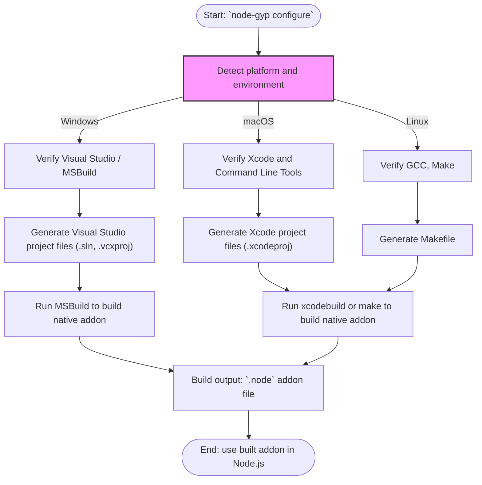

# Building Addons Across Platforms (Windows/macOS/Linux)

Manage cross-platform native builds confidently with node-gyp by understanding platform-specific toolchains, configuration patterns, and CLI options. This guide helps you configure and build native Node.js addons on Windows (MSVC/Visual Studio), macOS (Xcode/clang), and Linux (GCC/make), leveraging node-gyp's automatic adaptation to each environment.

---

## 1. Workflow Overview

### Task Description
Learn to effectively target multiple operating systems when building native Node.js addons using node-gyp, ensuring smooth compilation and linkage regardless of platform.

### Prerequisites
- A fully installed and configured node-gyp environment per your platform (see the guides on [Prerequisites & System Requirements](https://nodejs.org/docs/node-gyp/prerequisites-system-requirements) and platform-specific setup).
- An existing `binding.gyp` for your native addon.
- Python and compiler toolchains installed and detected (Visual Studio on Windows, Xcode on macOS, GCC/make on Linux).

### Expected Outcome
After following this guide, your addon will be configured and compiled appropriately on Windows, macOS, and Linux using native platform tools, respecting their peculiarities and efficient build conventions.

### Time Estimate
Allow 15 to 30 minutes, including environment validation and build execution per platform.

### Difficulty Level
Intermediate: requires familiarity with native build tools and concepts.

---

## 2. Understanding Platform-Specific Toolchain Configuration

node-gyp leverages **GYP** (Generate Your Projects), a meta-build system that creates native build files intrinsic to each platform:

- **Windows**: Generates Visual Studio `.sln` and `.vcxproj` files, using MSBuild and the MSVC compiler.
- **macOS**: Generates Xcode `.xcodeproj` bundles, using clang/clang++.
- **Linux and Unix**: Generates Makefiles or SCons files, typically building with GCC and `make`.

This means your native addon is always built using best practices and conventions of its platform.

### Key Points:
- Platform-detection occurs during the `configure` command.
- `binding.gyp` can include platform-specific conditionals to tailor sources, defines, flags.
- node-gyp sets sensible defaults for compilers and linker settings but allows overrides.

---

## 3. Step-by-Step Guide to Cross-Platform Builds

### Step 1: Write a Platform-Agnostic `binding.gyp` with Conditionals

Create or update your `binding.gyp` to include conditionals for platform-specific sources or flags:

```python
{
  'targets': [
    {
      'target_name': 'myaddon',
      'sources': [ 'src/common.cc' ],
      'conditions': [
        ['OS=="win"', {
          'sources': [ 'src/win_specific.cc' ],
          'defines': [ 'WIN32_LEAN_AND_MEAN' ],
          'msvs_settings': {
            'VCCLCompilerTool': {
              'AdditionalOptions': ['/EHsc'],
            },
          },
        }],
        ['OS=="mac"', {
          'sources': [ 'src/mac_specific.mm' ],
          'xcode_settings': {
            'OTHER_CFLAGS': ['-mmacosx-version-min=10.9'],
          },
        }],
        ['OS=="linux"', {
          'sources': [ 'src/linux_specific.cc' ],
          'cflags': ['-fPIC'],
          'ldflags': ['-shared'],
        }]
      ]
    }
  ]
}
```

- The `conditions` section customizes source files and compiler/linker options per platform.
- Use the exact platform names: `win` (Windows), `mac` (macOS), `linux` (Linux).

### Step 2: Configure the Build for the Specific Platform

Run the `node-gyp configure` command in your project root:

```bash
node-gyp configure
```

- On Windows, this generates Visual Studio solution and project files.
- On macOS, this generates Xcode project files.
- On Linux, this generates Makefiles.

Use `--debug` or `--release` (default) as needed.

#### Windows Example

```powershell
node-gyp configure --msvs_version=2022 --arch=x64
```

#### macOS/Linux Example

```bash
node-gyp configure --arch=x64
```

- You can specify other CLI options such as `--dist-url`, `--nodedir` etc. as needed per your environment.

### Step 3: Build the Addon

Invoke the build command:

```bash
node-gyp build
```

- On Windows, MSBuild runs with appropriate parameters.
- On Unix-like systems, `make` runs in the `build/` directory.

Optionally pass `-j <num>` to parallelize builds:

```bash
node-gyp build -j max
```

### Step 4: Verify Build Outputs

- Windows: `build/Release/myaddon.node` or equivalent.
- macOS/Linux: `build/Release/myaddon.node`.

Load your addon in Node.js to verify:

```js
const addon = require('./build/Release/myaddon.node')
console.log(addon.someFunction())
```

---

## 4. Best Practices and Tips

### 4.1 Use Platform Conditionals Consistently

Maintain sources and compiler options modularly in your `binding.gyp` to avoid build errors on unsupported platforms.

### 4.2 Handle Windows Toolchain Carefully

- Ensure Visual Studio or Build Tools are installed with the "Desktop development with C++" workload.
- Use `--msvs_version` CLI option if auto-detection fails.
- For ARM64 Windows builds, verify Visual Studio version ≥ 2022 17.4 and required ARM components.

### 4.3 macOS Configuration

- Use correct minimum macOS deployment target via `OTHER_CFLAGS`.
- Ensure Xcode Command Line Tools are installed (`xcode-select --install`).

### 4.4 Linux Environment

- Ensure `make` and GCC versions are compatible.
- Use `cflags` and `ldflags` in `binding.gyp` to add necessary flags like `-fPIC` or `-pthread`.

### 4.5 Leveraging CLI Options for Cross-Platform Builds

- `--arch`: Compile for specific architecture (ia32, x64, arm64, etc.)
- `--jobs` or `-j`: Parallelize the build to speed it up.
- `--dist-url` and `--nodedir`: Direct `node-gyp` where to find header files for custom Node versions.

### 4.6 Use Environment Variables Appropriately

- On Windows, set environment variables for Visual Studio detection as documented.
- Use `npm_config_node_gyp_*` variables to configure builds within npm scripts.

### 4.7 Clean Up

To avoid leftover build artifacts that may interfere with cross-platform consistency:

```bash
node-gyp clean
```

---

## 5. Common Pitfalls & Troubleshooting

<AccordionGroup title="Troubleshooting Cross-Platform Builds">
<Accordion title="Build Fails on Windows - MSBuild or VS Not Found">

**Cause:** Visual Studio or required build tools not properly installed or detected.

**Solution:**
- Install "Desktop development with C++" workload.
- Use `--msvs_version=YYYY` to specify VS version.
- Ensure environment PATH includes required tools.
- Refer to [Windows Visual Studio Setup](getting-started/setup-prerequisites-installation/windows-visual-studio-setup) guide.

</Accordion>
<Accordion title="macOS Build Errors - Missing Headers or SDK">

**Cause:** Xcode Command Line Tools missing or SDK mismatch.

**Solution:**
- Run `xcode-select --install` to install tools.
- Verify deployment target in `binding.gyp`.
- Use latest compatible Xcode.

</Accordion>
<Accordion title="Linux Build Errors - Undefined References, Compilation Failures">

**Cause:** Missing `-fPIC` or incompatible flags, missing libraries.

**Solution:**
- Add necessary `cflags` and `ldflags` in `binding.gyp`.
- Verify GCC and make are installed.
- Check for required development libraries.

</Accordion>
<Accordion title="Incorrect Source Files Compiled on Wrong Platforms">

**Cause:** Platform-specific source files included unconditionally.

**Solution:**
- Use `conditions` in `binding.gyp` to include/exclude sources based on OS.

</Accordion>
</AccordionGroup>

---

## 6. Example `binding.gyp` for Cross-Platform Native Addon

```python
{
  'targets': [
    {
      'target_name': 'crossplatformaddon',
      'sources': [ 'src/common.cc' ],
      'conditions': [
        ['OS=="win"', {
          'sources': [ 'src/win.cc' ],
          'defines': [ 'UNICODE', '_WIN32_WINNT=0x0601' ],
          'msvs_settings': {
            'VCCLCompilerTool': {
              'AdditionalOptions': ['/EHsc'],
            }
          }
        }],
        ['OS=="mac"', {
          'sources': [ 'src/mac.mm' ],
          'xcode_settings': {
            'OTHER_CFLAGS': ['-mmacosx-version-min=10.13']
          }
        }],
        ['OS=="linux"', {
          'sources': [ 'src/linux.cc' ],
          'cflags': ['-fPIC', '-Wall'],
          'ldflags': ['-pthread'],
        }]
      ]
    }
  ]
}
```

This example demonstrates source and build flag differentiation per OS.

---

## 7. Summary Mermaid Diagram: node-gyp Cross-Platform Build Workflow



---

## 8. Next Steps & Related Content

- Review the [Installing and Setting Up node-gyp](https://nodejs.org/docs/node-gyp/guides/getting-started/installing-and-setting-up) guide for environment setup.
- Explore [Writing Your First binding.gyp File](https://nodejs.org/docs/node-gyp/guides/getting-started/binding-gyp-basics) to deepen your understanding of configuration files.
- Consult [Targeting Specific Node.js Versions and Runtimes](https://nodejs.org/docs/node-gyp/guides/real-world-scenarios/working-with-node-versions) to handle multiple runtime targets.
- When encountering platform-specific errors, refer to the [Troubleshooting Common Build Errors](https://nodejs.org/docs/node-gyp/guides/real-world-scenarios/common-errors-troubleshooting) guide.

---

<Tip>
Consistently test builds on all target platforms early in your development cycle to catch platform-specific issues promptly.
</Tip>

<Note>
Always keep your `binding.gyp` synchronized with your source file structure and platform needs to avoid mysterious build failures.
</Note>

<Warning>
Do not assume all Unix-like environments are identical; macOS uses clang and Xcode project files, whereas Linux typically uses gcc and Makefiles.
</Warning>

<Check>
Verify that all required platform-dependent tools (Visual Studio/MSBuild, Xcode, GCC, Make) are installed and detected by node-gyp before building.
</Check>

---

[Back to node-gyp Guides Overview](https://nodejs.org/docs/node-gyp/guides/)

## References

- [GYP User Documentation](https://gyp.gsrc.io/docs/UserDocumentation.md)
- [binding.gyp Configuration Examples](https://nodejs.org/docs/node-gyp/overview/integration-and-ecosystem/addon-configs-and-examples)
- [node-gyp CLI Reference](https://nodejs.org/docs/node-gyp/README.md)
- [Platform Toolchain Setup Guides](https://nodejs.org/docs/node-gyp/getting-started/setup-prerequisites-installation)

