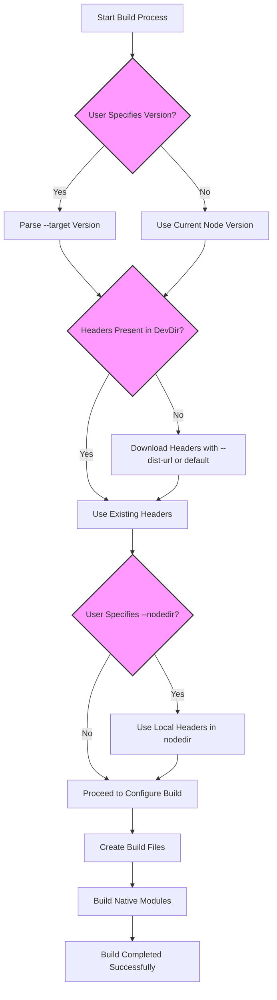

# Targeting Specific Node.js Versions and Runtimes

Node.js native addon development often requires building modules against multiple Node.js versions or alternative runtimes such as Electron. This page guides you step-by-step through targeting specific Node.js versions and runtimes reliably using node-gyp's built-in support for downloading headers, specifying version targets, and configuring custom runtime environments.

---

## 1. Overview

### What You Will Achieve
Learn how to build native modules consistently for different Node.js versions or third-party runtimes by managing header files, using version flags, and overriding configurations.

### Prerequisites
- node-gyp installed and working on your development environment.
- Basic familiarity with node-gyp build commands like `configure` and `build`.
- A native Node.js addon project with a valid `binding.gyp`.

### Outcome
Successfully build and compile your native addon for the targeted Node.js or runtime version with appropriate development headers.

### Time Estimate
10–20 minutes depending on environment setup and download speeds.

### Difficulty Level
Intermediate – requires understanding of build tools and Node.js addon environment.

---

## 2. Building for Specific Node.js Versions

To build against a specific Node.js version, node-gyp must have access to the respective Node.js development headers. You have several ways to specify this.

### Step 1: Specify Target Version with `--target`

Use the `--target` flag to define the Node.js version you want to build for, instead of the default current runtime.

```bash
node-gyp rebuild --target=14.17.0
```

This instructs node-gyp to download and use headers for Node.js v14.17.0.

### Step 2: Downloading the Correct Headers Automatically

When you specify `--target`, node-gyp downloads the appropriate headers from the remote distribution server (by default https://nodejs.org/dist). It caches these in your dev directory.

Use `--ensure` to avoid redundant downloads if headers already exist:

```bash
node-gyp install --target=14.17.0 --ensure
```

### Step 3: Override Header Source With `--dist-url`

If you use a custom mirror URL or alternative host for downloading node headers, provide the URL with `--dist-url`.

Example targeting a mirror:

```bash
node-gyp rebuild --target=14.17.0 --dist-url=https://example.com/custom-node-dist
```

### Step 4: Using `--nodedir` When Headers Are Local

If you already have Node.js headers locally (such as a downloaded source tree or alternative runtime), bypass downloading by passing the path with `--nodedir`:

```bash
node-gyp rebuild --nodedir=/path/to/local/node-headers
```

This directs node-gyp to use the headers and configuration found at that directory.

---

## 3. Building for Alternative Runtimes (e.g., Electron)

Many popular runtimes like Electron or NW.js come with their own Node.js versions and custom headers.

### Step 1: Identify the Runtime Version

Find the exact Node.js version the runtime uses, often shown in its documentation or release notes.

### Step 2: Download Headers With `--target` and Override Defaults

Use `--target` to specify the runtime’s Node.js version and override the header source with `--dist-url` that points to the runtime’s header location.

Example for Electron:

```bash
node-gyp rebuild --target=16.0.0 --dist-url=https://electronjs.org/headers
```

### Step 3: Pass Additional Overrides If Needed

Older Electron versions sometimes ship with malformed `config.gypi`. To work around this, add `--force-process-config` to force node-gyp to use the runtime’s process configuration.

```bash
node-gyp rebuild --target=11.0.0 --dist-url=https://electronjs.org/headers --force-process-config
```

### Step 4: Use Local Headers With `--nodedir`

Alternatively, if you download Electron headers yourself, you can build locally:

```bash
node-gyp rebuild --nodedir=/path/to/electron/headers
```

---

## 4. Practical Examples

### Example 1: Build for Node.js 12.22.1

```bash
node-gyp configure --target=12.22.1
node-gyp build --target=12.22.1
```

This builds your addon against Node.js 12.22.1 regardless of the Node.js runtime running node-gyp.

### Example 2: Build for Electron 14.0.0 with dist-url

```bash
node-gyp rebuild --target=14.0.0 --dist-url=https://electronjs.org/headers
```

### Example 3: Use Local Headers with nodedir

```bash
node-gyp configure --nodedir=/Users/me/projects/electron-headers
node-gyp build --nodedir=/Users/me/projects/electron-headers
```

---

## 5. Key Flags and Their Effects

| Flag | Description |
| --- | --- |
| `--target=version` | Specify which Node.js version to build for (default: current Node.js runtime). |
| `--dist-url=url` | Override the URL where node-gyp downloads headers and libraries. Useful for alternative runtimes or mirrors. |
| `--nodedir=path` | Use local source directory with headers for the target Node.js version or runtime. |
| `--ensure` | Only download/install headers if not present or outdated. Avoids redundant downloads. |
| `--force-process-config` | Force using runtime’s process.config for generating config files; helpful with malformed `config.gypi`. |

---

## 6. How node-gyp Manages Headers and Configuration

When you target a specific version or runtime, node-gyp:

- Processes the version using internal version resolution logic.
- Downloads or ensures the development headers and libraries are installed into your dev directory.
- Uses headers and configuration for generating platform and runtime specific build files.
- Applies any user overrides for dist-url or nodedir.

Headers include crucial files like `node.h`, `node_version.h`, and config files required by the build system.

---

## 7. Troubleshooting and Tips

### Download Failures or Header Missing
- Check internet connectivity and proxy settings.
- Use `--proxy` and `--noproxy` options if behind a proxy.
- Verify the `--dist-url` is correct and accessible.

### Unexpected Version Build
- Ensure you specify `--target` consistently in all configure/build commands.
- Clear your devdir cache to force re-install headers if version mismatch.

### Using `--nodedir` with Wrong Headers
- Verify the headers match the targeted Node.js or runtime version.
- Malformed config.gypi files in custom headers can cause `configure` errors.

### Electron or Alternative Runtimes
- Some Electron versions require `--force-process-config` due to broken shipped headers.
- Always use the runtime’s official headers URL or download headers directly from their source.

---

## 8. Next Steps and Related Documentation

- [Creating Your binding.gyp File](../getting-started/first-build-validation/creating-binding-gyp)
- [Configuring and Building Your Addon](../getting-started/first-build-validation/running-configure-build-commands)
- [How node-gyp Integrates with Your Environment](../../overview/integration-and-ecosystem/integration-with-environments)
- [Building Addons Across Platforms](../real-world-scenarios/cross-platform-builds)

---

## 9. Summary Diagram



---

## 10. Summary

By following this guide, you can precisely control which Node.js version or runtime your native addon targets. node-gyp provides flexible options to download or specify development headers and override configurations, enabling reliable builds for multiple environments.

<Tip>
Always keep your development headers up to date in your dev directory when targeting multiple versions to avoid inconsistencies.
</Tip>

<Note>
Use `node-gyp install --ensure --target=VERSION` to prefetch headers before building.
</Note>

---