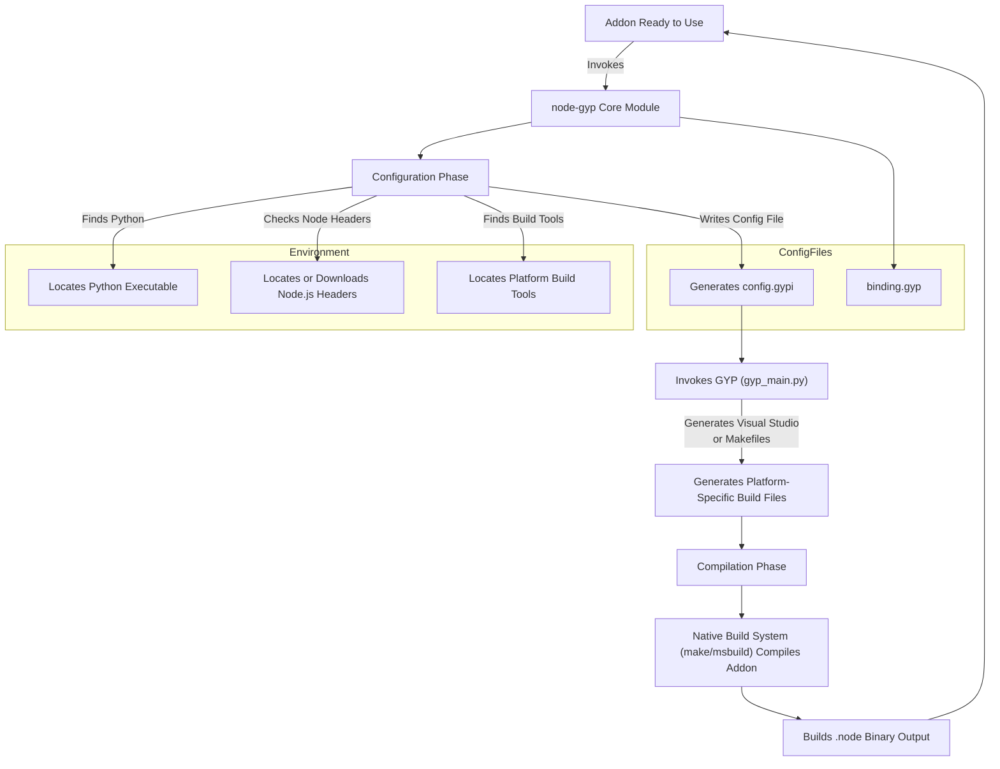

# How node-gyp Works: Architecture & Workflow

Welcome to a comprehensive guide on how **node-gyp** transforms native addon source code into compiled binaries. This page walks you through the core architecture and workflow stages that node-gyp orchestrates, helping you deeply understand the build process, what happens behind the scenes, and why it ensures a smooth, cross-platform build experience.

---

## Why Understanding the Workflow Matters

Working with native Node.js addons involves compiling C/C++ code into binary `.node` modules compatible with your system and Node.js version. node-gyp acts as the orchestrator that automates this complex transformation. Understanding its architecture and workflow empowers you to troubleshoot build issues effectively, customize your builds more confidently, and optimize integration with your development environment.

---

## High-Level Overview

At its core, node-gyp uses configuration files and system tools to generate platform-specific build files and performs compilation in a consistent, automated manner. The build process involves a set of clearly defined steps:

1. **User Command Execution** — You invoke node-gyp commands like `configure` and `build` from your terminal.
2. **Configuration Phase** — node-gyp processes the environment, locates dependencies (like Python, Node.js headers, Visual Studio), and generates configuration files such as `config.gypi`.
3. **Build File Generation** — Using GYP (Generate Your Projects), node-gyp converts your addon’s `binding.gyp` configuration into native build system files (Makefiles on Unix/macOS or Visual Studio project files on Windows).
4. **Compilation Phase** — The native build tools compile the source code and produce your addon’s binary output.

---

## Detailed Workflow Breakdown

### 1. User Commands and Input

- You start by running commands such as `node-gyp configure` to generate build files.
- These commands rely on the presence of a `binding.gyp` file in your project root, which describes your addon’s source files and build configuration.
- Command-line options and environment variables allow you to customize the build process, such as targeting different Node.js versions, specifying Python paths, or Visual Studio versions.

### 2. Configuration Phase

This is where node-gyp gathers all necessary metadata and environment-specific details.

- **Locating Node.js Headers:**
  - node-gyp checks if you have specified a Node.js source directory with `--nodedir`.
  - If not provided, it downloads the required development headers for the targeted Node.js version.
  - It validates header version compatibility by reading version macros from header files.

- **Finding Python and Build Tools:**
  - node-gyp locates the Python executable (required for running GYP’s Python scripts).
  - On Windows, it detects Visual Studio installation and toolsets, setting environment variables accordingly.

- **Creating the "build" directory and Configuration Files:**
  - node-gyp creates a `build/` directory if it does not already exist.
  - It then writes out `config.gypi`, a JSON-like file containing all configuration variables and build settings derived from the environment and command-line flags.

- **Preparing GYP Invocation:**
  - The configuration step compiles all `.gypi` includes.
  - It sets generator defaults based on platform: `msvs` on Windows, `make` on Unix/macOS.

### 3. Build File Generation

- node-gyp invokes the GYP build system generator (`gyp_main.py` via Python) with the aggregated arguments.
- GYP processes the `binding.gyp` and incorporated `.gypi` files producing platform-specific project files:
  - **Windows:** Visual Studio solution (`.sln`) and project (`.vcxproj`) files placed inside `build/`.
  - **Unix/macOS:** Makefiles generated in `build/`.

- These output files include detailed rules and paths to compile, link, and generate your addon’s native `.node` binary.

### 4. Compilation Phase

- When you run `node-gyp build` or `node-gyp rebuild`, the associated native build system is invoked:
  - **Make, GMake, or Ninja** on Unix/macOS/BSD/AIX.
  - **MSBuild** on Windows.

- node-gyp passes flags for build configuration (`Debug` or `Release`), target architecture, and concurrency (jobs/threads).

- Compilers compile source files, link libraries, and output a `.node` file in the appropriate directory (`build/Release/` or `build/Debug/`).

- When the build completes successfully, you can require this compiled add-on in your Node.js application.

---

## Visualizing the Architecture and Workflow

---

## Practical Tips & Best Practices

- **Always run `node-gyp configure` before building** to ensure all configurations and platform files are freshly generated.

- Use `--nodedir` or `--dist-url` when targeting specific Node.js runtimes or versions to ensure header compatibility.

- On Windows, specify `--msvs_version` if automatic Visual Studio detection fails or targets older versions.

- Keep your `binding.gyp` file organized, defining source files, include directories, and compilation flags clearly.

- Use verbose logging (`--verbose`) to see detailed progress and debug issues during configuration or build.

- If you hit header download or extraction failures, verify your internet connectivity and proxy settings.

---

## Common Pitfalls & Troubleshooting

- **Missing or incorrect Python path:** node-gyp relies on Python 3.x; specify explicitly if multiple versions exist with `--python`.

- **Wrong or missing Node.js headers:** Using the incorrect headers leads to build errors. Use `--nodedir` or `--target` to align header versions.

- **Visual Studio detection failures (Windows):** Install proper workloads or use `--msvs_version` flag; ensure environment variables for VS are set.

- **Not running configure before build:** Skipping configure means build files aren’t generated, breaking the build.

- **Permission issues creating `build/` directory:** Ensure your user has write access in the addon directory.

---

## Summary

The architecture and workflow of node-gyp revolve around automating the complex transformation from your addon source code to a native binary compatible with your platform and Node.js version. From CLI commands through configuration, build file generation, and compilation, node-gyp provides a seamless cross-platform development experience.

With this understanding, you can confidently customize builds, troubleshoot issues, and integrate native addons effectively.

---

## Learn More & Next Steps

- [binding.gyp Configuration and Examples](/overview/integration-and-ecosystem/addon-configs-and-examples): Learn how to write and structure your addon manifest.
- [Core Features at a Glance](/overview/introduction-and-value/core-features-quick-overview): Explore node-gyp’s powerful capabilities.
- [Supported Development Workflows](/overview/core-concepts-and-architecture/supported-workflows): Understand practical workflows supported by node-gyp.
- [Getting Started with node-gyp](https://github.com/nodejs/node-gyp#how-to-use): The official README with installation and basic commands.

---

This foundational knowledge will accelerate your journey in native Node.js addon development using node-gyp.
