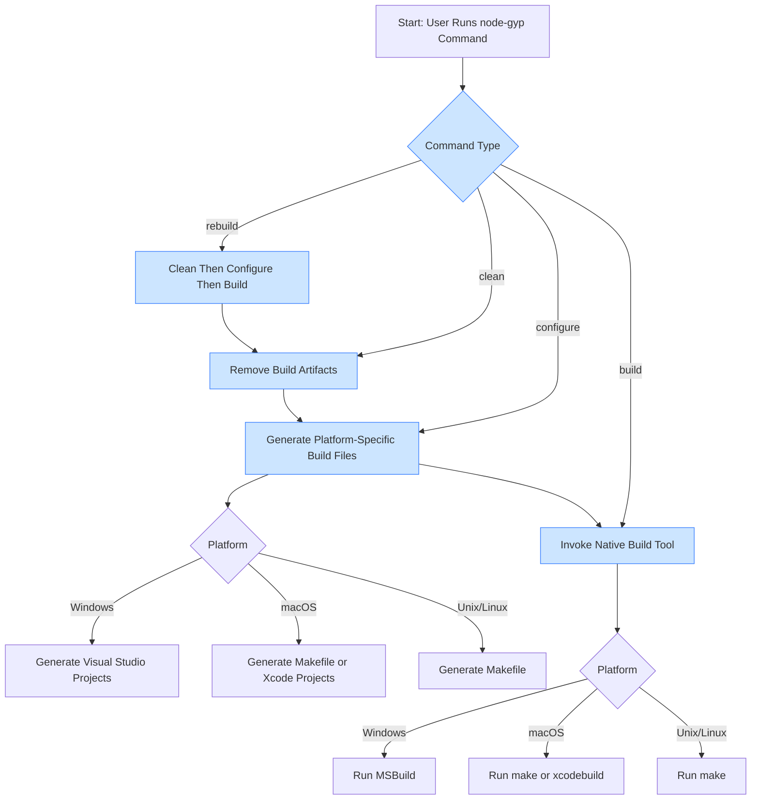

# Supported Development Workflows

Explore the typical workflows node-gyp supports across Unix, Windows, and macOS platforms. This guide explains how to build, rebuild, and clean native Node.js addons while adapting to the complexities of different toolchains and environments. Understanding these workflows ensures smooth compilation processes and efficient handling of native modules.

---

## Why Focus on Development Workflows?

Building native Node.js addons involves multiple steps, each crucial for successful compilation and integration. Developers want a reliable, straightforward process that spans platforms without manual intervention or configuration headaches. Node-gyp streamlines this by automating project file generation and invoking platform-appropriate build tools.

This page illustrates how node-gyp adapts its workflow for various platforms and user commands to help you achieve consistent, maintainable native builds.

---

## Typical User Intent and Goals

- Compile native addons successfully on Windows, macOS, or Linux
- Easily rebuild after source changes or configuration adjustments
- Clean up build artifacts when switching versions or troubleshooting
- Leverage consistent commands regardless of OS

Understanding node-gyp's workflow helps you anticipate how commands map to actions under the hood so you can develop and maintain native modules confidently.

---

## Core Supported Workflows

Node-gyp workflows consist primarily of three commands:

- **configure** — Generates the appropriate native project or Makefiles for your platform.
- **build** — Compiles the native addon using the previously generated build files.
- **clean** — Removes build artifacts, resetting the environment.

Additionally, the **rebuild** command chains clean-configure-build to reset and build in one go.

### The Standard Build Flow

1. Navigate to your addon directory containing `binding.gyp`.
2. Run `node-gyp configure` to generate platform-specific build configuration files.
3. Run `node-gyp build` to compile your native addon.
4. Use the compiled `.node` file as a require-able addon in your Node.js application.

<Tip>
Always run `configure` after editing `binding.gyp` or changing platform-specific toolchains to ensure build files reflect the latest settings.
</Tip>

### Rebuild for Convenience

If you need to clean previous builds and start fresh:

```bash
node-gyp rebuild
```

This runs `clean`, then `configure`, then `build` in sequence.

This is ideal when upgrading Node.js, switching environments, or resolving build errors.

### Cleaning Up

To remove all build files and artifacts:

```bash
node-gyp clean
```

This points you back to a clean slate to avoid stale or corrupted build outputs.

### Platform-Specific Workflow Notes

| Platform | Build System                | Notable Details                                                   |
|----------|----------------------------|------------------------------------------------------------------|
| Unix     | Makefile (`make`)           | Requires `make` and a compatible C/C++ compiler like GCC.        |
| macOS    | Makefile or Xcode           | Xcode Command Line Tools provide `clang`, `make`, and IDE files. |
| Windows  | MSBuild (`msbuild.exe`)     | Uses Visual Studio project files; requires Visual Studio Build Tools. |

On **Windows**, the `configure` step detects installed Visual Studio versions to select the correct toolchain automatically. You may specify `--msvs_version` if autodetection fails.

On **macOS** and **Unix**, `configure` produces Makefiles for faster CLI builds, but can optionally generate Xcode projects.

---

## Practical Examples

### Build on Unix (Linux/macOS)

```bash
cd my_node_addon
node-gyp configure
node-gyp build
```

Expected outcome:
- `build/Makefile` created by `configure`
- Compiled binary (`.node`) placed in `build/Release/`

### Build on Windows with Visual Studio 2019

```bash
cd my_node_addon
node-gyp configure --msvs_version=2019
node-gyp build
```

Expected outcome:
- `build/my_node_addon.vcxproj` Visual Studio project created
- Compiled binary in `build/Release/` or `build/Debug/`

### Quick Rebuild

```bash
node-gyp rebuild
```

Removes existing build artifacts, regenerates build files, and compiles.

---

## Tips for Troubleshooting Build Workflows

- **Configure first:** Always run `configure` after changing the configuration file (`binding.gyp`) or switching Node.js versions.
- **Specify Python explicitly** if multiple Python versions confuse node-gyp's detection: use `--python` option.
- On Windows, ensure Visual Studio Build Tools are installed, and PowerShell module `VSSetup` can help detection.
- Use verbose logging with `--verbose` or `--loglevel=verbose` for detailed command output.
- Remember that some platforms require elevated permissions or additional tools (like `make` on Unix/macOS).

<Warning>
Skipping the `configure` step before building may cause build failures due to out-of-date or missing project files.
</Warning>

---

## How node-gyp Adapts to Different Platforms

Node-gyp internally uses the `gyp-next` system to transform your `binding.gyp` into the right build configuration files for each platform. The workflow commands abstract away this complexity.



This flow ensures your builds match your development platform's native tools and conventions, while using a unified interface.

---

## Next Steps

- For beginners, see [Configuring and Building Your Addon](../getting-started/first-build-validation/running-configure-build-commands) for detailed usage.
- Learn how to write and structure your `binding.gyp` file in [Creating Your binding.gyp File](../getting-started/first-build-validation/creating-binding-gyp).
- If you face build errors, consult [Common Errors and How to Fix Them](../getting-started/troubleshooting-common-issues/common-errors-and-solutions).


---

## Summary

Node-gyp supports seamless native addon build workflows on all major platforms by generating platform-appropriate project files and invoking the correct build systems. Whether you're working on Unix, macOS, or Windows, the commands `configure`, `build`, `clean`, and `rebuild` drive the typical development lifecycle for your native modules.

Clear separation of these phases enables straightforward build management and integration into various development environments.

Use this page to align your workflow with node-gyp's platform-aware methods for smooth, reliable compilation experiences.

---

[Back to Core Concepts & Architecture Overview](/overview/core-concepts-and-architecture/component-architecture)

[Return to Overview](/overview/introduction-and-value/product-overview)

---