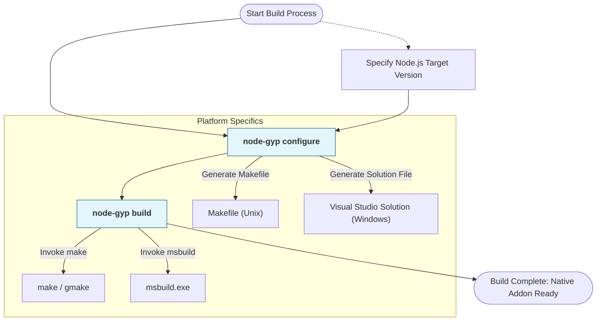

# Key Features at a Glance

Discover the core strengths of node-gyp, the essential tool for building native Node.js addons. This page highlights the major features that make node-gyp a reliable, flexible, and streamlined solution for compiling native code across platforms and Node.js runtime environments.

---

## Consistent Cross-Platform Builds

node-gyp abstracts the complexity of native builds by supporting Windows, macOS, and Linux with a unified interface. Regardless of your operating system, node-gyp generates the appropriate build files (`Makefile`, `VCXPROJ`, or equivalent) and invokes the native build tools (`make`, `msbuild`, etc.) seamlessly. This consistency removes platform-specific roadblocks and lets you focus on development rather than build setup.

**Example Scenario:**
> A developer maintaining a library with native C++ code can run the same `node-gyp configure` and `node-gyp build` commands on Windows, macOS, or Linux without changing build scripts.

---

## Support for Different Node.js Runtime Versions

Building native addons often means targeting different Node.js versions or third-party runtimes (like Electron). node-gyp enables this with options like `--target`, `--dist-url`, and `--nodedir` that control which Node.js headers and configurations are used during compilation.

- Downloads necessary headers and development files for the specified Node.js version
- Allows building against custom Node.js forks or runtimes by specifying header locations
- Supports fallback to the Node.js version installed on your system when no target is specified

**Benefit:** Maintain compatibility across multiple Node.js environments without changing source code.

---

## Flexible Python and Compiler Integration

node-gyp requires Python (2.x or supported 3.x versions) and native compilers but integrates these flexibly:

- Detects and uses the system-installed Python or a user-specified Python executable (`--python` option)
- Accommodates different compiler toolchains depending on the platform and user setup
- On Windows, leverages Visual Studio versions specified explicitly or auto-detected
- On Unix-like systems, works natively with `make` and compatible compilers such as GCC or Clang

This flexibility simplifies accommodating diverse development environments.

---

## Custom Build Configuration via `binding.gyp`

At the heart of every native addon build is the `binding.gyp` file, a declarative JSON-like configuration that describes what to build and how.

- Specify source files, targets, compiler flags, and libraries
- Control build behavior without modifying node-gyp itself
- Enables modular and reusable build setups across projects

Example minimal `binding.gyp` snippet:

```json
{
  "targets": [
    {
      "target_name": "myaddon",
      "sources": ["src/myaddon.cc"]
    }
  ]
}
```

node-gyp generates your platform-specific build files based on this configuration.

---

## Streamlined Workflows for Native Code Development

node-gyp condenses common build steps into simple commands:

- `configure`: generates platform-specific project files
- `build`: compiles the native addon
- `rebuild`: cleans, configures, and builds in one step

These commands integrate well into manual workflows, CI/CD pipelines, or npm scripts, reducing the learning curve and improving build automation.

---

## Visualizing node-gyp's Core Feature Workflow



---

## Practical Tips and Best Practices

- **Always run `node-gyp configure` before building.** This generates the necessary platform-specific files.
- **Use `--target` or `--nodedir` to specify Node.js version or runtime headers** when supporting multiple environments or third-party runtimes.
- **Specify `--python` if multiple Python versions are installed** on your system to avoid ambiguity.
- **Leverage the `binding.gyp` file to control build specifics**, keeping your build process declarative and maintainable.
- **For Windows users, ensure the correct Visual Studio version is installed** and specify it with `--msvs_version` if auto-detection fails.
- **Use `node-gyp rebuild` for a one-step clean, configure, and build process** to ensure a fresh build.

---

## Troubleshooting Common Issues

- **Missing or incompatible Python:** Confirm Python version compatibility and set the `--python` option explicitly.
- **Visual Studio detection problems (Windows):** Install the required C++ build tools and specify `--msvs_version`.
- **Header files not found for wrong Node.js target:** Use `--target`, `--dist-url`, or `--nodedir` to point to the correct headers.
- **Build fails without running configure:** Always run `configure` first to generate build files.

If issues persist, consult detailed troubleshooting guides linked in the main documentation.

---

## Summary

This page gave you a quick tour of the core features node-gyp offers: consistent cross-platform builds, flexible support for various Node.js runtime versions, adaptable Python and compiler integration, and customizable build setup via `binding.gyp`. It is designed to help you achieve smooth and repeatable native addon builds.

**Ready to start building native addons?** Check out the [Getting Started Guide](/getting-started/setup-prerequisites-installation/prerequisites-system-requirements) and [Creating Your binding.gyp File](/getting-started/first-build-validation/creating-binding-gyp).

---

## Related Documentation

- [What Is node-gyp?](./product-overview) — Understand the product and its purpose
- [Who Should Use node-gyp?](./target-audience-use-cases) — Identify if node-gyp fits your needs
- [How node-gyp Works: Architecture & Workflow](./component-architecture) — Deep dive into how node-gyp orchestrates builds
- [Example: binding.gyp and Typical Addon Structure](./addon-configs-and-examples) — Practical examples of build configuration

---

## Key Links

- GitHub Repository: [https://github.com/nodejs/node-gyp](https://github.com/nodejs/node-gyp)
- Node.js Native Addon Documentation: [https://nodejs.org/api/addons.html](https://nodejs.org/api/addons.html)
- gyp User Documentation: [https://gyp.gsrc.io/docs/UserDocumentation.md](https://gyp.gsrc.io/docs/UserDocumentation.md)

---